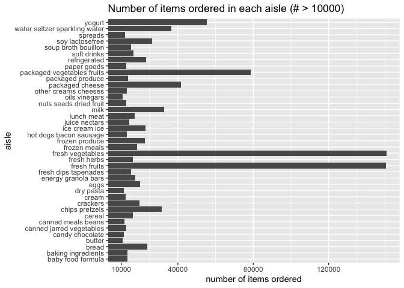

p8105_hw3_sy3352
================
Su Yan
2025-10-06

# Problem 1

The `instacart` data set contains data of order details people placed on
instacart in 2017. It contains 1384617 observations and 15 columns. Each
row gives detailed information of one product in an order. Some of the
key variables are `order_id` `product_id` `reordered` `order_dow`
`order_hour_of_day` `product_name` `aisle` and `department`. For
example, row 3859 displayed an **Organic Baby Carrots** ordered by
userid **198041** on Saturday afternoon (`order_dow`: 6 and
`order_hour_of_day`: 18), which belongs to aisle **packaged vegetables
fruits** and department **produce**.

``` r
aisle_amount = count(instacart, aisle, sort = TRUE)
aisle_amount
```

    ## # A tibble: 134 × 2
    ##    aisle                              n
    ##    <chr>                          <int>
    ##  1 fresh vegetables              150609
    ##  2 fresh fruits                  150473
    ##  3 packaged vegetables fruits     78493
    ##  4 yogurt                         55240
    ##  5 packaged cheese                41699
    ##  6 water seltzer sparkling water  36617
    ##  7 milk                           32644
    ##  8 chips pretzels                 31269
    ##  9 soy lactosefree                26240
    ## 10 bread                          23635
    ## # ℹ 124 more rows

There are 134 aisles. The most ordered aisles are `fresh vegetables`,
`fresh fruits`, `packaged vegetables fruits`, `yogurt` and
`packaged cheese`.

``` r
aisle_amount = filter(aisle_amount, n>10000) 
aisle_amount |> 
  ggplot(aes(x = reorder(aisle,n), y = n)) + 
  geom_col() +
  coord_flip(ylim = c(10000, NA)) + 
  scale_y_continuous(breaks = c(10000, 40000, 80000, 120000)) +
  labs(title = "Number of items ordered in each aisle (# > 10000)",
       x = "aisle",
       y = "number of items ordered")
```

<!-- -->

Most Popular Items in Selected Aisles:

``` r
top_3_aisle = filter(instacart, aisle == c("baking ingredients", "dog food care", "packaged vegetables fruits")) |> 
  select(aisle, product_name) |> 
  group_by(aisle, product_name) |> 
  summarize(number_items_ordered = n()) |> 
  group_by(aisle) |> 
  slice_max(number_items_ordered, n = 3) |> 
  knitr::kable(digits = 0) 
```

    ## `summarise()` has grouped output by 'aisle'. You can override using the
    ## `.groups` argument.

``` r
top_3_aisle
```

| aisle | product_name | number_items_ordered |
|:---|:---|---:|
| baking ingredients | Light Brown Sugar | 157 |
| baking ingredients | Pure Baking Soda | 140 |
| baking ingredients | Organic Vanilla Extract | 122 |
| dog food care | Organix Grain Free Chicken & Vegetable Dog Food | 14 |
| dog food care | Organix Chicken & Brown Rice Recipe | 13 |
| dog food care | Original Dry Dog | 9 |
| packaged vegetables fruits | Organic Baby Spinach | 3324 |
| packaged vegetables fruits | Organic Raspberries | 1920 |
| packaged vegetables fruits | Organic Blueberries | 1692 |

The mean hour of the day at which the selected two products are ordered:

``` r
product_week_hour = filter(instacart, product_name == c("Pink Lady Apples", "Coffee Ice Cream")) |> 
  select(order_dow, product_name, order_hour_of_day) |> 
  pivot_wider(names_from = order_dow,
              values_from = order_hour_of_day,
              names_prefix = "day_",
              values_fn = mean) |> 
  rename(Sunday = "day_0", Monday = "day_1", Tuesday = "day_2", Wednesday = "day_3",
         Thursday = "day_4", Friday = "day_5", Saturday = "day_6") |> 
  select(product_name, Sunday, Monday, Tuesday, Wednesday, Thursday, Friday, Saturday) |> 
  knitr::kable(digits = 0)
```

    ## Warning: There was 1 warning in `filter()`.
    ## ℹ In argument: `product_name == c("Pink Lady Apples", "Coffee Ice Cream")`.
    ## Caused by warning in `product_name == c("Pink Lady Apples", "Coffee Ice Cream")`:
    ## ! longer object length is not a multiple of shorter object length

``` r
product_week_hour
```

| product_name     | Sunday | Monday | Tuesday | Wednesday | Thursday | Friday | Saturday |
|:-----------------|-------:|-------:|--------:|----------:|---------:|-------:|---------:|
| Coffee Ice Cream |     13 |     15 |      15 |        15 |       15 |     10 |       12 |
| Pink Lady Apples |     12 |     12 |      12 |        14 |       12 |     14 |       12 |

# Problem 2

``` r
rent_df = read_csv("data/Zip_zori_uc_sfrcondomfr_sm_month_NYC.csv") |> 
  pivot_longer(cols = 10:125,
               names_to = "date",
               values_to = "rent_rate") |> 
  janitor::clean_names() |> 
  select(-region_type, -state_name, -state, -city, -metro, -region_id, -size_rank) |> 
  rename(zip_code = region_name)
```

    ## Rows: 149 Columns: 125
    ## ── Column specification ────────────────────────────────────────────────────────
    ## Delimiter: ","
    ## chr   (6): RegionType, StateName, State, City, Metro, CountyName
    ## dbl (119): RegionID, SizeRank, RegionName, 2015-01-31, 2015-02-28, 2015-03-3...
    ## 
    ## ℹ Use `spec()` to retrieve the full column specification for this data.
    ## ℹ Specify the column types or set `show_col_types = FALSE` to quiet this message.

``` r
zip_df = read_csv("data/Zip Codes.csv") |> 
  janitor::clean_names() |> 
  select(-county_code, -county_fips, -state_fips, -file_date, -county)
```

    ## Rows: 322 Columns: 7
    ## ── Column specification ────────────────────────────────────────────────────────
    ## Delimiter: ","
    ## chr (4): County, County Code, File Date, Neighborhood
    ## dbl (3): State FIPS, County FIPS, ZipCode
    ## 
    ## ℹ Use `spec()` to retrieve the full column specification for this data.
    ## ℹ Specify the column types or set `show_col_types = FALSE` to quiet this message.

``` r
rent_neigh_joint_df = rent_df |> 
  left_join(zip_df, by = c("zip_code")) |> 
  relocate(last_col(), .after = 2) |> 
  drop_na(rent_rate)
```

    ## Warning in left_join(rent_df, zip_df, by = c("zip_code")): Detected an unexpected many-to-many relationship between `x` and `y`.
    ## ℹ Row 4757 of `x` matches multiple rows in `y`.
    ## ℹ Row 256 of `y` matches multiple rows in `x`.
    ## ℹ If a many-to-many relationship is expected, set `relationship =
    ##   "many-to-many"` to silence this warning.

``` r
count_zip = rent_neigh_joint_df |> 
  group_by(zip_code) |> 
  summarize(month_count = n()) 
```

47 zip codes are observed 116 times. 26 zip codes are observed less than
10 times. Possible reasons for some zip codes to be observed fewer than
others can be that they are commercial zip codes or PO-box zip codes
which does not represent residential significance and thus does not
provide consistent rent information. For example, the zip code **10044**
was observed 9 times. It stands for Roosevelt island which has a small
area and thus less housing for rent, resulting in less rental
information provided.

``` r
year_trend = rent_neigh_joint_df |> 
  mutate(year = year(date)) |> 
  select(-zip_code, -date, -neighborhood) |> 
  pivot_wider(names_from = year,
              values_from = rent_rate,
              names_prefix = "year_",
              values_fn = mean,
              names_sort = TRUE) |> 
  rename(borough = county_name) |> 
  knitr::kable(digits = 2)
year_trend
```

| borough | year_2015 | year_2016 | year_2017 | year_2018 | year_2019 | year_2020 | year_2021 | year_2022 | year_2023 | year_2024 |
|:---|---:|---:|---:|---:|---:|---:|---:|---:|---:|---:|
| Queens County | 2214.71 | 2271.96 | 2263.30 | 2291.92 | 2387.82 | 2315.63 | 2210.79 | 2406.04 | 2561.62 | 2694.02 |
| Kings County | 2524.58 | 2551.01 | 2574.49 | 2576.71 | 2661.27 | 2582.44 | 2580.08 | 2901.29 | 3049.06 | 3159.53 |
| Bronx County | 1803.41 | 1645.70 | 1652.60 | 1721.19 | 1783.64 | 1872.65 | 1910.71 | 2089.67 | 2304.98 | 2506.04 |
| New York County | 3022.04 | 3038.82 | 3133.85 | 3183.70 | 3310.41 | 3106.52 | 3136.63 | 3778.37 | 3932.61 | 4078.44 |
| Richmond County | NA | NA | NA | NA | NA | 1977.61 | 2045.43 | 2147.44 | 2332.93 | 2536.44 |

# Problem 3
