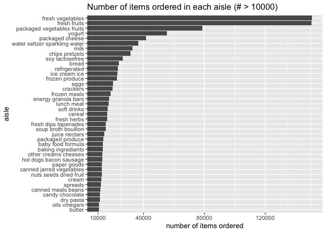

p8105_hw3_sy3352
================
Su Yan
2025-10-06

# Problem 1

The `instacart` data set contains data of order details people placed on
instacart in 2017. It contains 1384617 observations and 15 columns. Each
row gives detailed information of one product in an order. Some of the
key variables are `order_id` `product_id` `reordered` `order_dow`
`order_hour_of_day` `product_name` `aisle` and `department`. For
example, row 3859 displayed an **Organic Baby Carrots** ordered by
userid **198041** on Saturday afternoon (`order_dow`: 6 and
`order_hour_of_day`: 18), which belongs to aisle **packaged vegetables
fruits** and department **produce**.

``` r
aisle_amount = count(instacart, aisle, sort = TRUE)
aisle_amount
```

    ## # A tibble: 134 × 2
    ##    aisle                              n
    ##    <chr>                          <int>
    ##  1 fresh vegetables              150609
    ##  2 fresh fruits                  150473
    ##  3 packaged vegetables fruits     78493
    ##  4 yogurt                         55240
    ##  5 packaged cheese                41699
    ##  6 water seltzer sparkling water  36617
    ##  7 milk                           32644
    ##  8 chips pretzels                 31269
    ##  9 soy lactosefree                26240
    ## 10 bread                          23635
    ## # ℹ 124 more rows

There are 134 aisles. The most ordered aisles are `fresh vegetables`,
`fresh fruits`, `packaged vegetables fruits`, `yogurt` and
`packaged cheese`.

``` r
aisle_amount = filter(aisle_amount, n>10000)
aisle_amount |> ggplot(aes(x = aisle, y = n)) + 
  geom_col() +
  coord_flip(ylim = c(10000, NA)) + 
  scale_y_continuous(breaks = c(10000, 40000, 80000, 120000)) +
  labs(title = "Number of items ordered in each aisle (# > 10000)",
       y = "number of items ordered")
```

<!-- -->

# Problem 2

# Problem 3
