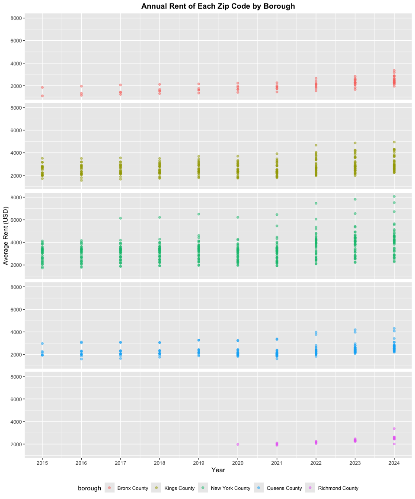
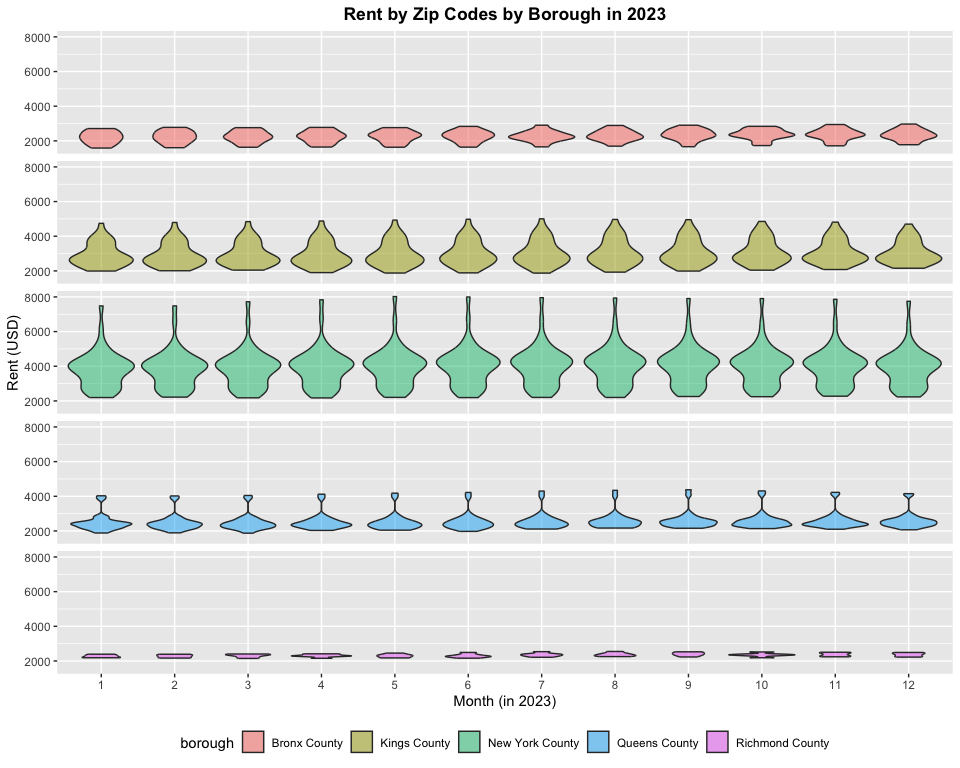
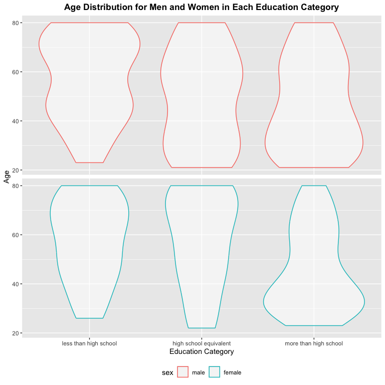
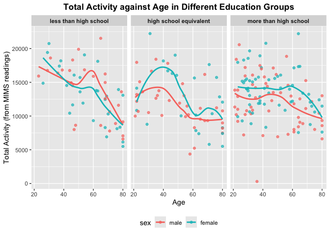
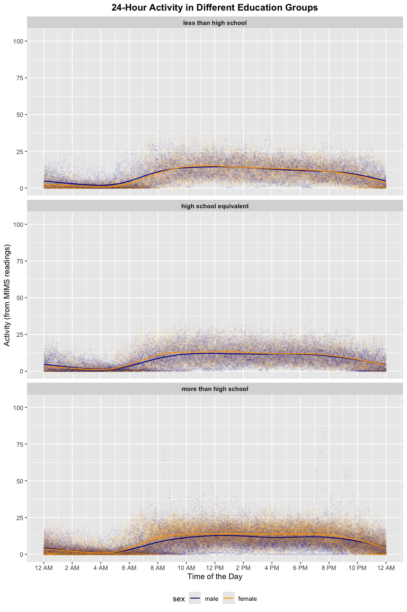

p8105_hw3_sy3352
================
Su Yan
2025-10-06

# Problem 1

The `instacart` data set contains data of order details people placed on
instacart in 2017. It contains 1384617 observations and 15 columns. Each
row gives detailed information of one product in an order. Some of the
key variables are `order_id` `product_id` `reordered` `order_dow`
`order_hour_of_day` `product_name` `aisle` and `department`. For
example, row 3859 displayed an **Organic Baby Carrots** ordered by
userid **198041** on Saturday afternoon (`order_dow`: 6 and
`order_hour_of_day`: 18), which belongs to aisle **packaged vegetables
fruits** and department **produce**.

``` r
aisle_amount = count(instacart, aisle, sort = TRUE)
aisle_amount
```

    ## # A tibble: 134 × 2
    ##    aisle                              n
    ##    <chr>                          <int>
    ##  1 fresh vegetables              150609
    ##  2 fresh fruits                  150473
    ##  3 packaged vegetables fruits     78493
    ##  4 yogurt                         55240
    ##  5 packaged cheese                41699
    ##  6 water seltzer sparkling water  36617
    ##  7 milk                           32644
    ##  8 chips pretzels                 31269
    ##  9 soy lactosefree                26240
    ## 10 bread                          23635
    ## # ℹ 124 more rows

There are 134 aisles. The most ordered aisles are `fresh vegetables`,
`fresh fruits`, `packaged vegetables fruits`, `yogurt` and
`packaged cheese`.

``` r
aisle_amount = filter(aisle_amount, n>10000) 
aisle_amount |> 
  ggplot(aes(x = reorder(aisle,n), y = n)) + 
  geom_col() +
  coord_flip(ylim = c(10000, NA)) + 
  scale_y_continuous(breaks = c(10000, 40000, 80000, 120000)) +
  labs(title = "Number of items ordered in each aisle (# > 10000)",
       x = "aisle",
       y = "number of items ordered")
```

<!-- -->

Most Popular Items in Selected Aisles:

``` r
top_3_aisle = filter(instacart, aisle == c("baking ingredients", "dog food care", "packaged vegetables fruits")) |> 
  select(aisle, product_name) |> 
  group_by(aisle, product_name) |> 
  summarize(number_items_ordered = n()) |> 
  group_by(aisle) |> 
  slice_max(number_items_ordered, n = 3) |> 
  knitr::kable(digits = 0) 
```

    ## `summarise()` has grouped output by 'aisle'. You can override using the
    ## `.groups` argument.

``` r
top_3_aisle
```

| aisle | product_name | number_items_ordered |
|:---|:---|---:|
| baking ingredients | Light Brown Sugar | 157 |
| baking ingredients | Pure Baking Soda | 140 |
| baking ingredients | Organic Vanilla Extract | 122 |
| dog food care | Organix Grain Free Chicken & Vegetable Dog Food | 14 |
| dog food care | Organix Chicken & Brown Rice Recipe | 13 |
| dog food care | Original Dry Dog | 9 |
| packaged vegetables fruits | Organic Baby Spinach | 3324 |
| packaged vegetables fruits | Organic Raspberries | 1920 |
| packaged vegetables fruits | Organic Blueberries | 1692 |

The mean hour of the day at which the selected two products are ordered:

``` r
product_week_hour = filter(instacart, product_name == c("Pink Lady Apples", "Coffee Ice Cream")) |> 
  select(order_dow, product_name, order_hour_of_day) |> 
  pivot_wider(names_from = order_dow,
              values_from = order_hour_of_day,
              names_prefix = "day_",
              values_fn = mean) |> 
  rename(Sunday = "day_0", Monday = "day_1", Tuesday = "day_2", Wednesday = "day_3",
         Thursday = "day_4", Friday = "day_5", Saturday = "day_6") |> 
  select(product_name, Sunday, Monday, Tuesday, Wednesday, Thursday, Friday, Saturday) |> 
  knitr::kable(digits = 0)
```

    ## Warning: There was 1 warning in `filter()`.
    ## ℹ In argument: `product_name == c("Pink Lady Apples", "Coffee Ice Cream")`.
    ## Caused by warning in `product_name == c("Pink Lady Apples", "Coffee Ice Cream")`:
    ## ! longer object length is not a multiple of shorter object length

``` r
product_week_hour
```

| product_name     | Sunday | Monday | Tuesday | Wednesday | Thursday | Friday | Saturday |
|:-----------------|-------:|-------:|--------:|----------:|---------:|-------:|---------:|
| Coffee Ice Cream |     13 |     15 |      15 |        15 |       15 |     10 |       12 |
| Pink Lady Apples |     12 |     12 |      12 |        14 |       12 |     14 |       12 |

# Problem 2

``` r
rent_df = read_csv("data/Zip_zori_uc_sfrcondomfr_sm_month_NYC.csv") |> 
  pivot_longer(cols = 10:125,
               names_to = "date",
               values_to = "rent_rate") |> 
  janitor::clean_names() |> 
  select(-region_type, -state_name, -state, -city, -metro, -region_id, -size_rank) |> 
  rename(zip_code = region_name)
```

    ## Rows: 149 Columns: 125
    ## ── Column specification ────────────────────────────────────────────────────────
    ## Delimiter: ","
    ## chr   (6): RegionType, StateName, State, City, Metro, CountyName
    ## dbl (119): RegionID, SizeRank, RegionName, 2015-01-31, 2015-02-28, 2015-03-3...
    ## 
    ## ℹ Use `spec()` to retrieve the full column specification for this data.
    ## ℹ Specify the column types or set `show_col_types = FALSE` to quiet this message.

``` r
zip_df = read_csv("data/Zip Codes.csv") |> 
  janitor::clean_names() |> 
  select(-county_code, -county_fips, -state_fips, -file_date, -county) |> 
  distinct(zip_code, .keep_all = TRUE)
```

    ## Rows: 322 Columns: 7
    ## ── Column specification ────────────────────────────────────────────────────────
    ## Delimiter: ","
    ## chr (4): County, County Code, File Date, Neighborhood
    ## dbl (3): State FIPS, County FIPS, ZipCode
    ## 
    ## ℹ Use `spec()` to retrieve the full column specification for this data.
    ## ℹ Specify the column types or set `show_col_types = FALSE` to quiet this message.

``` r
rent_neigh_joint_df = rent_df |> 
  left_join(zip_df, by = c("zip_code")) |> 
  relocate(last_col(), .after = 2) |> 
  drop_na(rent_rate)
```

``` r
count_zip = rent_neigh_joint_df |> 
  group_by(zip_code) |> 
  summarize(month_count = n()) 
```

48 zip codes are observed 116 times. 26 zip codes are observed less than
10 times. Possible reasons for some zip codes to be observed fewer than
others can be that they are commercial zip codes or PO-box zip codes
which does not represent residential significance and thus does not
provide consistent rent information. For example, the zip code **10044**
was observed 9 times. It stands for Roosevelt island which has a small
area and thus less housing for rent, resulting in less rental
information provided.

``` r
year_trend = rent_neigh_joint_df |> 
  mutate(year = year(date)) |> 
  select(-zip_code, -date, -neighborhood) |> 
  pivot_wider(names_from = year,
              values_from = rent_rate,
              names_prefix = "year_",
              values_fn = mean,
              names_sort = TRUE) |> 
  rename(borough = county_name) |> 
  knitr::kable(digits = 2)
year_trend
```

| borough | year_2015 | year_2016 | year_2017 | year_2018 | year_2019 | year_2020 | year_2021 | year_2022 | year_2023 | year_2024 |
|:---|---:|---:|---:|---:|---:|---:|---:|---:|---:|---:|
| Queens County | 2214.71 | 2271.96 | 2263.30 | 2291.92 | 2387.82 | 2315.63 | 2210.79 | 2406.04 | 2561.62 | 2694.02 |
| Kings County | 2492.93 | 2520.36 | 2545.83 | 2547.29 | 2630.50 | 2555.05 | 2549.89 | 2868.20 | 3015.18 | 3126.80 |
| Bronx County | 1759.60 | 1520.19 | 1543.60 | 1639.43 | 1705.59 | 1811.44 | 1857.78 | 2054.27 | 2285.46 | 2496.90 |
| New York County | 3022.04 | 3038.82 | 3133.85 | 3183.70 | 3310.41 | 3106.52 | 3136.63 | 3778.37 | 3932.61 | 4078.44 |
| Richmond County | NA | NA | NA | NA | NA | 1977.61 | 2045.43 | 2147.44 | 2332.93 | 2536.44 |

From the table above, we can see that in general, the rental prices
across all boroughs in NYC increased consistently from year 2015 to year
2024, except in year 2022 when the impact of covid-19 caused on overall
decline in rental pr1ices compared with the previous year. There were no
rental data available for Richmond County until year 2020.  
Among the 5 boroughs that we compare, New York County consistently has
the highest rental prices, and the Bronx County has the lowest.  
Bronx county experienced the fastest rent growth among the 5 boroughs
with its rent in 2024 being **1.41** times higher compared to what’s in
2015. In contrast, Queens has the slowest rent growth with a **1.22**
times higher rent in 2024 compared with that in 2015.

``` r
zip_year = rent_neigh_joint_df |> 
  mutate(year = year(date)) |> 
  select(-date) |> 
  group_by(county_name, zip_code, year) |> 
  summarize(yearly_rent = mean(rent_rate, na.rm = TRUE)) |> 
  rename(borough = county_name) 
```

    ## `summarise()` has grouped output by 'county_name', 'zip_code'. You can override
    ## using the `.groups` argument.

``` r
zip_year_plot = 
  zip_year |> ggplot(aes(x=year, y = yearly_rent, color = borough)) + 
  geom_point(alpha = .5) + 
  facet_wrap(~borough, ncol = 1) +
  scale_x_continuous(breaks = 2015:2024) +
  labs(
    title = "Annual Rent of Each Zip Code by Borough",
    x = "Year",
    y = "Average Rent (USD)"
  ) +
  theme(strip.text = element_blank(),
        plot.title = element_text(face = "bold", hjust = 0.5),
        legend.position = "bottom")
zip_year_plot
```

<!-- --> The
plot shows the annual rent price by zip code in NYC from 2015 to 2024.
The 5 boroughs in the plot are represented by 5 different colors as
shown in the legend at the bottom. Each point in the plot represents a
zip code’s rent in a certain year. From the plot we can see overall all
5 boroughs in NYC experience a steady growth (except for 2020-2021 due
to covid-19 impact) in rent and also a more and more spread-out price
range. Richmond County has no data available during 2015 to 2019, thus
the points only starts from 2020. New York County has not only overall
highest rent but also the widest range of rents, indicating the most
diversity in housing rental options.

``` r
zip_mon_2023 = rent_neigh_joint_df |> 
  mutate(date = as.Date(date),
         month = lubridate::month(date)) |> 
  filter(lubridate::year(date) == 2023) |> 
  select(-date, -neighborhood) |> 
  rename(borough = county_name) 
```

``` r
zip_mon_2023_plot = 
  zip_mon_2023 |> ggplot(aes(x = factor(month), y = rent_rate, fill = borough)) + 
  geom_violin(alpha = .5) +
  facet_wrap(~borough, ncol = 1) +
  labs(
    title = "Rent by Zip Codes by Borough in 2023",
    x = "Month (in 2023)",
    y = "Rent (USD)"
  ) +
  theme(strip.text = element_blank(),
        plot.title = element_text(face = "bold", hjust = 0.5),
        legend.position = "bottom")
zip_mon_2023_plot
```

<!-- -->

The plot shows the rent price of each zip code in NYC by month of 2023.
The 5 boroughs in the plot are represented by 5 different colors as
shown in the legend at the bottom. Each violin in the plot represents
the allocation of rental price of zip codes in each month. From the plot
we can see overall all 5 boroughs in NYC has a stable retal price
throughout the year, with a very slight steady growth towards the end of
the year. New York County has not only overall highest rent but also the
widest range of rents, indicating the most diversity in housing rental
options. Bronx and Richmond County has relatively low rent but also the
most tightly clustered rent distribution, indicating that housing
options in these boroughs are relatively uniformed.

``` r
ggsave(filename = "results/zillow_rent_combined_plot.png",
       plot = zip_year_plot / zip_mon_2023_plot,
       width = 10,
       height = 20,
       dpi = 600)
```

# Problem 3

``` r
covar_df = read_csv("data/nhanes_covar.csv",skip = 4) |> 
  janitor::clean_names() |> 
  filter(!(bmi == "na"), !(education == "na"), age >= 21) |> 
  mutate(sex = factor(sex), education = factor(education)) |> 
  mutate(sex = recode(sex, `1` = "male", `2` = "female"),
         education = recode(education, `1` = "less than high school",
                            `2` = "high school equivalent",
                            `3` = "more than high school")) 
```

    ## Rows: 250 Columns: 5
    ## ── Column specification ────────────────────────────────────────────────────────
    ## Delimiter: ","
    ## dbl (5): SEQN, sex, age, BMI, education
    ## 
    ## ℹ Use `spec()` to retrieve the full column specification for this data.
    ## ℹ Specify the column types or set `show_col_types = FALSE` to quiet this message.

``` r
accel_df = read_csv("data/nhanes_accel.csv") |> 
  janitor::clean_names() |> 
  pivot_longer(
    cols = starts_with("min"),
    names_to = "minute",
    values_to = "mims"
  )
```

    ## Rows: 250 Columns: 1441
    ## ── Column specification ────────────────────────────────────────────────────────
    ## Delimiter: ","
    ## dbl (1441): SEQN, min1, min2, min3, min4, min5, min6, min7, min8, min9, min1...
    ## 
    ## ℹ Use `spec()` to retrieve the full column specification for this data.
    ## ℹ Specify the column types or set `show_col_types = FALSE` to quiet this message.

``` r
joint_mims = accel_df |> 
  left_join(covar_df, by = c("seqn")) |> 
  filter(!(bmi == "na"), !(education == "na")) 
```

``` r
edu_gender = 
  covar_df |> select(-seqn, -age, -bmi) |> 
  group_by(education, sex) |> 
  summarize(n = n()) |> 
  pivot_wider(names_from = sex, values_from = n) |> 
  knitr::kable()
```

    ## `summarise()` has grouped output by 'education'. You can override using the
    ## `.groups` argument.

``` r
edu_gender
```

| education              | male | female |
|:-----------------------|-----:|-------:|
| less than high school  |   27 |     28 |
| high school equivalent |   35 |     23 |
| more than high school  |   56 |     59 |

**The figure above shows the**

``` r
age_edu_plot = 
  covar_df |> 
  ggplot(aes(x = factor(education), y = age, color = sex)) + 
  geom_violin(alpha = .5) + 
  facet_wrap(~sex, ncol = 1) +
  labs(
    title = "Age Distribution for Men and Women in Each Education Category",
    x = "Education Category",
    y = "Age"
  ) +
  theme(strip.text = element_blank(),
        plot.title = element_text(face = "bold", hjust = 0.5),
        legend.position = "bottom")
age_edu_plot
```

<!-- -->

The figure above shows the number of men and women in each education
category and their age distribution. In general, both in male and
female, the higher the participants’ education levels are, the age
distribution is more clustered around younger numbers. For example, the
population with less than high school education is clustered around age
70 and the higher than high school education population is clustered
around age 30. Another noticeable pattern from the figure is that the
age distribution in male across all three education group appears to be
more extreme compared with women.

``` r
total_activity = joint_mims |> 
  group_by(seqn, sex, age, education) |> 
  summarize(total_activity = sum(mims, na.rm = TRUE)) 
```

    ## `summarise()` has grouped output by 'seqn', 'sex', 'age'. You can override
    ## using the `.groups` argument.

``` r
total_activity_plot = total_activity |> 
  ggplot(aes(x = age, y = total_activity, color = sex)) + 
  geom_point(alpha = .7) + 
  geom_smooth(se = FALSE) + 
  facet_wrap(~education) +
  labs(
    title = "Total Activity against Age in Different Education Groups",
    x = "Age",
    y = "Total Activity (from MIMS readings)"
  ) +
  theme(plot.title = element_text(face = "bold", hjust = 0.5),
        legend.position = "bottom",
        strip.text = element_text(face = "bold"))
total_activity_plot 
```

    ## `geom_smooth()` using method = 'loess' and formula = 'y ~ x'

<!-- -->

The figure above shows the total activity against age distribution, with
each dot representing a participant. Color blue and pink indicate male
and female, as shown in the legend at the bottom.From the graph we can
see that in the “less than high school” education group, the total
activity and age correlation are between genders cross over each other,
indicating no significant difference. In the two other education group,
male’s total activity is consistently higher than that of female’s
across all ages. Across all education group and gender, total activity
goes down as age goes up. The correlation appears the steepest in “less
than high school” education group and the least pronounced in “more than
high school” group.

``` r
activity_24h = joint_mims |> 
  select(-bmi, -age) |> 
  mutate(minute = as.numeric(gsub("min", "", minute))) 

activity_24h_plot = activity_24h |> 
  ggplot(aes(x = minute, y = mims, color = sex)) + 
  geom_point(alpha = .03, size = .2) + 
  geom_smooth(se = FALSE, size = .6, span = .2) + 
  facet_wrap(~education, ncol = 1) +
  scale_x_continuous(breaks = seq(0,1440, by = 120),
                     labels = c("12 AM", "2 AM", "4 AM", "6 AM", "8 AM", "10 AM", 
                                "12 PM", "2 PM", "4 PM", "6 PM", "8 PM", "10 PM", "12 AM")) +
  scale_color_manual(values = c("male" = "darkblue", "female" = "orange")) +
  labs(
    title = "24-Hour Activity in Different Education Groups",
    x = "Time of the Day",
    y = "Activity (from MIMS readings)"
  ) +
  theme(plot.title = element_text(face = "bold", hjust = 0.5),
        legend.position = "bottom",
        strip.text = element_text(face = "bold"))
```

    ## Warning: Using `size` aesthetic for lines was deprecated in ggplot2 3.4.0.
    ## ℹ Please use `linewidth` instead.
    ## This warning is displayed once every 8 hours.
    ## Call `lifecycle::last_lifecycle_warnings()` to see where this warning was
    ## generated.

``` r
activity_24h_plot
```

    ## `geom_smooth()` using method = 'gam' and formula = 'y ~ s(x, bs = "cs")'

<!-- -->

The figure above shows the 24-hour activity time courses for each
education level. Gender is indicated using different color as shown in
the legend at the bottom. Across all education groups and genders,
participants tend to be most active during daytime (the activity level
data starts to rise from bottom at around 5am and reaches its peak at
10am, and remained steady until around 8pm). In “less than high school”
education group, females and males have relatively similar 24-hour
activity pattern. In contrast, in the “more than high school” groups,
females have a slightly higher 24-hour activity level than male
throughout the day.
